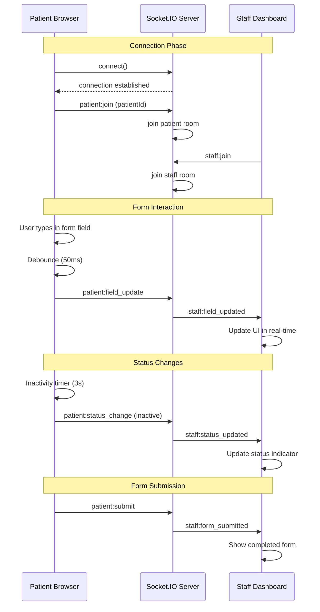

# Deployment Planning Documentation

## 📋 Table of Contents

1. [Project Structure](#project-structure)
2. [System Architecture](#system-architecture)
3. [Component Architecture](#component-architecture)
4. [Real-time Synchronization Flow](#real-time-synchronization-flow)
5. [Deployment Strategy](#deployment-strategy)
6. [Environment Configuration](#environment-configuration)
7. [Scaling Considerations](#scaling-considerations)
8. [Monitoring & Logging](#monitoring--logging)
9. [Security Considerations](#security-considerations)
10. [Backup & Recovery](#backup--recovery)

## 🏗️ Project Structure

### Directory Breakdown

```
agnos-health-assignment/
├── app/                          # Next.js App Router (Pages)
│   ├── page.tsx                 # Home/Landing page
│   │   ├── Features overview
│   │   ├── Navigation to patient/staff portals
│   │   └── Real-time connection status
│   ├── patient/page.tsx         # Patient Form Interface
│   │   ├── Multi-step medical form
│   │   ├── Real-time field validation
│   │   ├── Status tracking (filling/inactive/submitted)
│   │   └── Patient ID generation & display
│   ├── staff/page.tsx           # Staff Dashboard
│   │   ├── Active patient monitoring
│   │   ├── Real-time form data display
│   │   ├── Patient selection & details view
│   │   └── Statistics & activity tracking
│   ├── layout.tsx              # Root Layout Component
│   │   ├── Global font configuration
│   │   ├── Socket provider wrapper
│   │   └── Meta tags configuration
│   └── globals.css             # Global Styles
│       ├── TailwindCSS base styles
│       ├── Custom utility classes
│       └── Component-specific styles
├── components/                  # Reusable React Components
│   ├── providers/              # Context Providers
│   │   └── SocketProvider.tsx  # Socket.IO Context Management
│   │       ├── Connection management
│   │       ├── Event handling
│   │       ├── Room management
│   │       └── Reconnection logic
│   └── ui/                     # UI Component Library
│       └── CommonPageBackground.tsx  # Shared background component
├── lib/                        # Utility Libraries
│   └── types.ts               # TypeScript Type Definitions
│       ├── PatientFormData interface
│       ├── Patient interface
│       ├── Status enums
│       └── Socket event types
├── public/                     # Static Assets
│   └── common-page-background.webp  # Background image asset
├── server.js                   # Socket.IO Server
│   ├── WebSocket connection handling
│   ├── Room management
│   ├── Event broadcasting
│   └── CORS configuration
├── package.json               # Dependencies & Scripts
├── next.config.js            # Next.js Configuration
├── tailwind.config.js        # TailwindCSS Configuration
├── tsconfig.json             # TypeScript Configuration
└── .env.local               # Environment Variables
```

### File Responsibilities

| File/Directory | Primary Responsibility | Key Features |
|----------------|----------------------|--------------|
| `app/page.tsx` | Landing page & navigation | Portal selection, connection status |
| `app/patient/page.tsx` | Patient form interface | Multi-step form, real-time sync |
| `app/staff/page.tsx` | Staff monitoring dashboard | Patient list, real-time updates |
| `components/providers/SocketProvider.tsx` | WebSocket management | Connection, events, reconnection |
| `lib/types.ts` | Type definitions | Interfaces, enums, event types |
| `server.js` | Backend WebSocket server | Room management, event broadcasting |

## 🏛️ System Architecture

### High-Level Architecture

```
┌─────────────────┐    WebSocket     ┌─────────────────┐    HTTP/WebSocket    ┌─────────────────┐
│   Patient       │ ◄──────────────► │   Socket.IO     │ ◄──────────────────► │   Staff         │
│   Browser       │                  │   Server        │                     │   Dashboard     │
└─────────────────┘                  └─────────────────┘                     └─────────────────┘
         │                                    │                                      │
         │                                    │                                      │
    Next.js Client                     Node.js Server                        Next.js Client
    (React + Socket.IO)                 (Express + Socket.IO)                (React + Socket.IO)
```

### Technology Stack Details

#### Frontend Layer
- **Next.js 14**: React framework with App Router
- **React 18**: Component-based UI with hooks
- **TypeScript**: Type safety and IntelliSense
- **TailwindCSS**: Utility-first styling
- **Socket.IO Client**: Real-time communication

#### Backend Layer
- **Node.js**: JavaScript runtime environment
- **Express.js**: Web application framework
- **Socket.IO**: WebSocket server implementation
- **CORS**: Cross-origin resource sharing

#### Data Flow Architecture
- **Event-driven**: Real-time updates via Socket.IO events
- **Room-based isolation**: Each patient in separate room
- **Broadcasting**: Staff receive all patient updates
- **Debouncing**: Optimized field update frequency

## 🧩 Component Architecture

### Component Hierarchy

```
App (layout.tsx)
├── SocketProvider
│   ├── Connection management
│   ├── Event listeners
│   └── Room management
├── Home Page (page.tsx)
│   ├── Navigation cards
│   └── Connection status
├── Patient Page (patient/page.tsx)
│   ├── FormField components
│   ├── Status indicators
│   └── Patient ID display
└── Staff Page (staff/page.tsx)
    ├── PatientCard components
    ├── PatientDetailView
    └── Statistics components
```

### Key Components

#### SocketProvider
```typescript
interface SocketProviderProps {
  children: React.ReactNode
}

// Responsibilities:
- Establish WebSocket connection
- Manage connection state
- Handle reconnection logic
- Provide socket context to children
- Manage room subscriptions
```

#### FormField (Patient Page)
```typescript
interface FormFieldProps {
  label: string
  field: keyof PatientFormData
  type?: string
  required?: boolean
  options?: string[]
  value: string
  onChange: (value: string) => void
  error?: string
}

// Responsibilities:
- Render form input elements
- Handle input validation
- Display error states
- Emit real-time updates
```

#### PatientCard (Staff Page)
```typescript
interface PatientCardProps {
  patient: Patient
  onSelect: (patientId: string) => void
  isSelected: boolean
}

// Responsibilities:
- Display patient summary
- Show current status
- Handle selection events
- Format patient ID
```

#### PatientDetailView (Staff Page)
```typescript
interface PatientDetailViewProps {
  patient: Patient
}

// Responsibilities:
- Display complete patient information
- Organize data by sections
- Show timestamps
- Format form data display
```

### State Management

#### Local State (useState)
- Form data in patient component
- Selected patient in staff component
- Connection status indicators
- Error states and validation

#### Context State (SocketProvider)
- WebSocket connection instance
- Connection status (isConnected)
- Event emission functions
- Room management functions

#### Server State (Socket.IO Rooms)
- Patient sessions (individual rooms)
- Staff monitoring (broadcast room)
- Real-time data synchronization
- Connection lifecycle management

## 🔄 Real-time Synchronization Flow

### Connection Establishment

```
1. Patient/Staff loads page
2. SocketProvider initializes connection
3. Client connects to Socket.IO server
4. Server assigns socket ID
5. Client joins appropriate room(s)
6. Connection status updated in UI
```

### Patient Form Flow

```
Patient Input Flow:
┌─────────────────┐    ┌─────────────────┐    ┌─────────────────┐    ┌─────────────────┐
│ Patient Types   │───▶│ Debounced Emit  │───▶│ Server Broadcast │───▶│ Staff Dashboard │
│ in Form Field   │    │ (50ms delay)    │    │ to Staff Room   │    │ Real-time Update │
└─────────────────┘    └─────────────────┘    └─────────────────┘    └─────────────────┘

Status Change Flow:
┌─────────────────┐    ┌─────────────────┐    ┌─────────────────┐    ┌─────────────────┐
│ Patient Status  │───▶│ Emit Status     │───▶│ Server Broadcast │───▶│ Staff Dashboard │
│ Change Event    │    │ Change Event    │    │ to Staff Room   │    │ Status Update   │
└─────────────────┘    └─────────────────┘    └─────────────────┘    └─────────────────┘
```

### Event Flow Diagram



### Socket.IO Events

#### Patient-Side Events
```typescript
// Connection Events
'patient:join'           // Join patient room
'patient:leave'          // Leave patient room

// Form Events
'patient:field_update'   // Individual field changes
'patient:status_change'  // Status updates
'patient:submit'         // Form submission
```

#### Staff-Side Events
```typescript
// Connection Events
'staff:join'             // Join monitoring room
'staff:leave'            // Leave monitoring room

// Update Events
'staff:field_updated'    // Receive field updates
'staff:status_updated'   // Receive status updates
'staff:patient_joined'   // New patient notification
'staff:form_submitted'   // Form submission notification
'staff:patient_left'     // Patient departure notification
```

### Data Synchronization Strategy

#### Debouncing Implementation
```typescript
const debouncedEmit = useCallback(
  (() => {
    const timers: Record<string, NodeJS.Timeout> = {}
    
    return (field: string, value: any) => {
      const timerKey = `field_${field}`
      if (timers[timerKey]) {
        clearTimeout(timers[timerKey])
      }
      
      timers[timerKey] = setTimeout(() => {
        emit('patient:field_update', { patientId, field, value })
      }, 50) // 50ms debounce delay
    }
  })(),
  [patientId]
)
```

#### Inactivity Detection
```typescript
// 3-second inactivity timer
const inactivityTimer = setTimeout(() => {
  setStatus('inactive')
  emit('patient:status_change', { patientId, status: 'inactive' })
}, 3000)
```

#### Room Isolation
- Each patient joins individual room: `patient_${patientId}`
- All staff join shared room: `staff_monitoring`
- Server broadcasts patient events to staff room
- Ensures data isolation and efficient message routing

## 🚀 Deployment Strategy

### Environment Setup

#### Development Environment
```bash
# Local development
npm run dev          # Next.js dev server (port 3000)
node server.js       # Socket.IO server (port 3001)
```

#### Production Environment
```bash
# Production build
npm run build        # Optimize Next.js build
npm start           # Start production server
pm2 start server.js  # Process management for Socket.IO
```

### Deployment Options

#### Option 1: Single Server Deployment
```
Server (Ubuntu/CentOS)
├── Nginx (Reverse Proxy)
│   ├── SSL Termination
│   ├── Static file serving
│   └── Load balancing
├── Next.js Application (Port 3000)
│   ├── React application
│   ├── API routes
│   └── Static assets
└── Socket.IO Server (Port 3001)
    ├── WebSocket handling
    ├── Room management
    └── Event broadcasting
```

#### Option 2: Containerized Deployment
```dockerfile
# Dockerfile for Next.js app
FROM node:18-alpine
WORKDIR /app
COPY package*.json ./
RUN npm ci --only=production
COPY . .
RUN npm run build
EXPOSE 3000
CMD ["npm", "start"]
```

```yaml
# docker-compose.yml
version: '3.8'
services:
  nextjs:
    build: .
    ports:
      - "3000:3000"
    environment:
      - NODE_ENV=production
  
  socket-server:
    build: .
    command: node server.js
    ports:
      - "3001:3001"
    environment:
      - NODE_ENV=production
  
  nginx:
    image: nginx:alpine
    ports:
      - "80:80"
      - "443:443"
    volumes:
      - ./nginx.conf:/etc/nginx/nginx.conf
```

### Infrastructure Requirements

#### Minimum Requirements
- **CPU**: 2 cores
- **RAM**: 4GB
- **Storage**: 20GB SSD
- **Network**: 100 Mbps

#### Recommended Production Setup
- **CPU**: 4+ cores
- **RAM**: 8GB+
- **Storage**: 50GB+ SSD
- **Network**: 1 Gbps
- **Load Balancer**: For high availability

## ⚙️ Environment Configuration

### Environment Variables

#### Development (.env.local)
```env
NEXT_PUBLIC_SOCKET_URL=http://localhost:3001
NEXT_PUBLIC_APP_URL=http://localhost:3000
NODE_ENV=development
PORT=3000
SOCKET_PORT=3001
```

#### Production (.env.production)
```env
NEXT_PUBLIC_SOCKET_URL=https://your-domain.com:3001
NEXT_PUBLIC_APP_URL=https://your-domain.com
NODE_ENV=production
PORT=3000
SOCKET_PORT=3001

# Security
CORS_ORIGIN=https://your-domain.com
SESSION_SECRET=your-secret-key

# Monitoring
LOG_LEVEL=info
METRICS_ENABLED=true
```

### Nginx Configuration

```nginx
server {
    listen 80;
    server_name your-domain.com;
    return 301 https://$server_name$request_uri;
}

server {
    listen 443 ssl http2;
    server_name your-domain.com;

    ssl_certificate /path/to/certificate.crt;
    ssl_certificate_key /path/to/private.key;

    # Next.js application
    location / {
        proxy_pass http://localhost:3000;
        proxy_http_version 1.1;
        proxy_set_header Upgrade $http_upgrade;
        proxy_set_header Connection 'upgrade';
        proxy_set_header Host $host;
        proxy_set_header X-Real-IP $remote_addr;
        proxy_set_header X-Forwarded-For $proxy_add_x_forwarded_for;
        proxy_set_header X-Forwarded-Proto $scheme;
        proxy_cache_bypass $http_upgrade;
    }

    # WebSocket connections
    location /socket.io/ {
        proxy_pass http://localhost:3001;
        proxy_http_version 1.1;
        proxy_set_header Upgrade $http_upgrade;
        proxy_set_header Connection "upgrade";
        proxy_set_header Host $host;
        proxy_set_header X-Real-IP $remote_addr;
        proxy_set_header X-Forwarded-For $proxy_add_x_forwarded_for;
        proxy_set_header X-Forwarded-Proto $scheme;
    }
}
```

## 📈 Scaling Considerations

### Horizontal Scaling

#### Multiple Application Servers
```
Load Balancer
├── App Server 1 (Next.js + Socket.IO)
├── App Server 2 (Next.js + Socket.IO)
├── App Server 3 (Next.js + Socket.IO)
└── Shared Database/Cache
```

#### Socket.IO Scaling with Redis Adapter
```javascript
// server.js with Redis adapter
const redis = require('socket.io-redis');
io.adapter(redis({ host: 'redis-server', port: 6379 }));
```

### Database Scaling (Future Enhancement)
```javascript
// Potential database integration
const { Pool } = require('pg');

// Patient data persistence
const patientData = {
  id: 'P-XXXXX-XXXX',
  formData: {...},
  status: 'submitted',
  createdAt: timestamp,
  updatedAt: timestamp
};
```

### Performance Optimization

#### Client-Side Optimization
- Code splitting with Next.js dynamic imports
- Image optimization with Next.js Image component
- Bundle size monitoring and optimization
- Service worker for offline functionality

#### Server-Side Optimization
- Connection pooling for database
- Redis for session storage
- CDN for static assets
- Gzip compression enabled

## 📊 Monitoring & Logging

### Application Monitoring

#### Metrics to Track
```javascript
// Custom metrics
const metrics = {
  activeConnections: 0,
  totalPatients: 0,
  formsSubmitted: 0,
  averageResponseTime: 0,
  errorRate: 0
};
```

#### Health Check Endpoint
```javascript
// API route for health checks
app.get('/api/health', (req, res) => {
  res.json({
    status: 'healthy',
    timestamp: new Date().toISOString(),
    connections: io.engine.clientsCount,
    uptime: process.uptime()
  });
});
```

### Logging Strategy

#### Structured Logging
```javascript
// Winston logging configuration
const logger = winston.createLogger({
  level: 'info',
  format: winston.format.json(),
  transports: [
    new winston.transports.File({ filename: 'error.log', level: 'error' }),
    new winston.transports.File({ filename: 'combined.log' })
  ]
});
```

#### Error Tracking
```javascript
// Global error handling
process.on('uncaughtException', (error) => {
  logger.error('Uncaught Exception:', error);
  process.exit(1);
});

process.on('unhandledRejection', (reason, promise) => {
  logger.error('Unhandled Rejection:', reason);
});
```

## 🔒 Security Considerations

### WebSocket Security
```javascript
// Socket.IO security configuration
io.use((socket, next) => {
  const token = socket.handshake.auth.token;
  // Validate token here
  if (isValidToken(token)) {
    next();
  } else {
    next(new Error('Authentication error'));
  }
});
```

### CORS Configuration
```javascript
// Secure CORS setup
const corsOptions = {
  origin: process.env.CORS_ORIGIN,
  methods: ['GET', 'POST'],
  credentials: true
};
```

### Data Validation
```typescript
// Input validation on server side
const validatePatientData = (data: any): boolean => {
  const schema = {
    firstName: Joi.string().required(),
    lastName: Joi.string().required(),
    email: Joi.string().email().required(),
    // ... other fields
  };
  
  const { error } = Joi.validate(data, schema);
  return !error;
};
```

### Rate Limiting
```javascript
// Rate limiting for Socket.IO connections
const rateLimit = require('express-rate-limit');

const limiter = rateLimit({
  windowMs: 15 * 60 * 1000, // 15 minutes
  max: 100 // limit each IP to 100 requests per windowMs
});
```

## 💾 Backup & Recovery

### Data Backup Strategy

#### Configuration Backup
```bash
# Backup configuration files
tar -czf config-backup-$(date +%Y%m%d).tar.gz \
  .env.production \
  nginx.conf \
  package.json \
  next.config.js
```

#### Application State Backup
```javascript
// Periodic state backup
const backupAppState = async () => {
  const state = {
    activePatients: getActivePatients(),
    timestamp: new Date().toISOString(),
    version: process.env.APP_VERSION
  };
  
  await fs.writeFile(
    `backup-${Date.now()}.json`,
    JSON.stringify(state, null, 2)
  );
};
```

### Disaster Recovery

#### Recovery Procedures
1. **Server Failure**: Auto-restart with PM2
2. **Data Loss**: Restore from latest backup
3. **Network Issues**: Graceful degradation mode
4. **High Load**: Auto-scaling trigger

#### Monitoring Alerts
```javascript
// Alert configuration
const alerts = {
  highConnectionCount: 1000,
  highErrorRate: 0.05, // 5%
  lowMemory: 100 * 1024 * 1024, // 100MB
  highResponseTime: 5000 // 5 seconds
};
```

---

## 📞 Support & Maintenance

### Regular Maintenance Tasks
- Weekly dependency updates
- Monthly security patches
- Quarterly performance reviews
- Annual capacity planning

### Emergency Contacts
- Development Team: [contact-info]
- System Administrator: [contact-info]
- Network Operations: [contact-info]

---

**This deployment planning document provides comprehensive guidance for deploying, scaling, and maintaining the Agnos Health Assignment application in production environments.**
